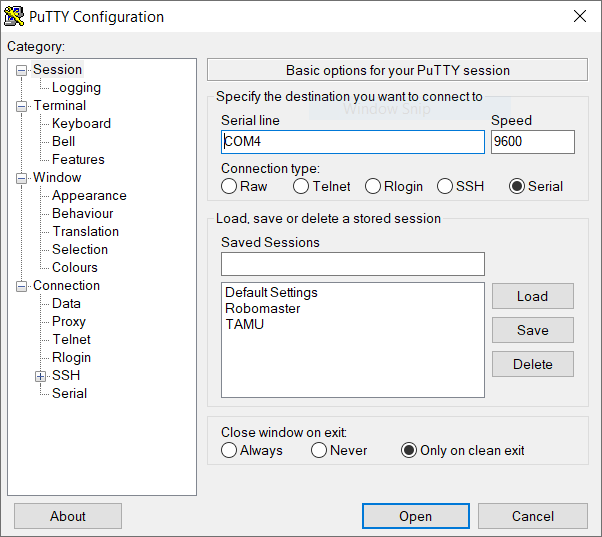
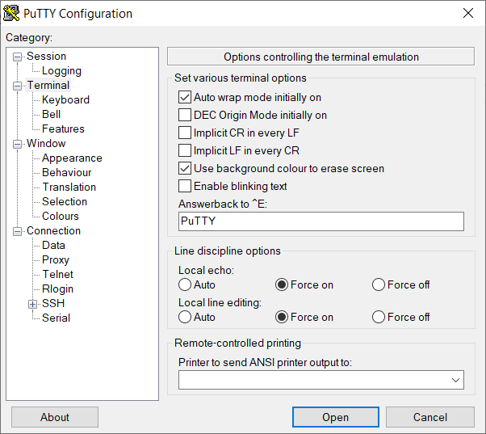

# Before Mashing the Keyboard

1. This project uses **FreeRTOS**.

2. To add functions, first make changes in **FreeRTOS_USB_USART_Echo.ioc** using **STM32CubeMX**, i.e. add a task (FreeRTOS terminology), then generate code using **STM32CubeMX**, edit the code in **Keil uvision**, compile and flash the development board.

3. Having only one dev board will work. You should see all the desired behaviour outline in the [Commands You Can Play With & Observations](#-commands-you-can-play-with-&-observations) section.

4. To work with two-board communication, you need two dev boards.

# Getting Started

1. Compile the code.

2. Download the code to the development board(s).

3. Use a micro USB cable to connect the development board and your computer.

4. *Optional*: if you have two boards:

    1. Connect one board to the computer via USB.
    
    2. Connect the two board on their USART 6 ports. Note:
    
        | Pin on dev board A 	    | Pin on dev board B 	|
        |------------------------	|----------------------	|
        | RX                     	| TX                   	|
        | TX                     	| RX                   	|
        | GND                     	| GND                  	|

    3. DO NOT CONNECT THE VCC PINS ON BOTH DEV BOARDS TOGETHER!

4. Identify the COM/serial port that identifies the development board. On Windows, you can use **Device Manager**.

4. Install **Putty**. Use the following pictures to change Putty settings.

Set the communication parameters:



Set the display parameters:



# Commands You Can Play With & Observations

**With 1 dev board**

1. Any string starts with **q**. The response will be **you typed q\r\n**.

2. Any string starts with **w**. The response will be **you typed w\r\n**.

3. For any other strings, the response will repeat what you have sent over USB.

**Only with 2 dev boards**

Regardless of whether sening strings or not, or the content of the string, one green LED light will turn on and off every second on each board.

# How to Use USB in Your Code

1. For modifying the behaviour when receiving data on the USB CDC interface, edit the **CDC_Receive_FS** function in **usbd_cdc_if.c**.

2. For sending data from the USB CDC interface, do

    ```c++
    #include "usbd_cdc_if.h"
    ```

    to include the necessary header, then do

    ```c++
    uint8_t Buffer[] = ...;
    CDC_Transmit_FS(Buffer, sizeof(Buffer));		
    ```

    **Buffer** is the uint8_t array that holds the data for sending.

Happy hacking!